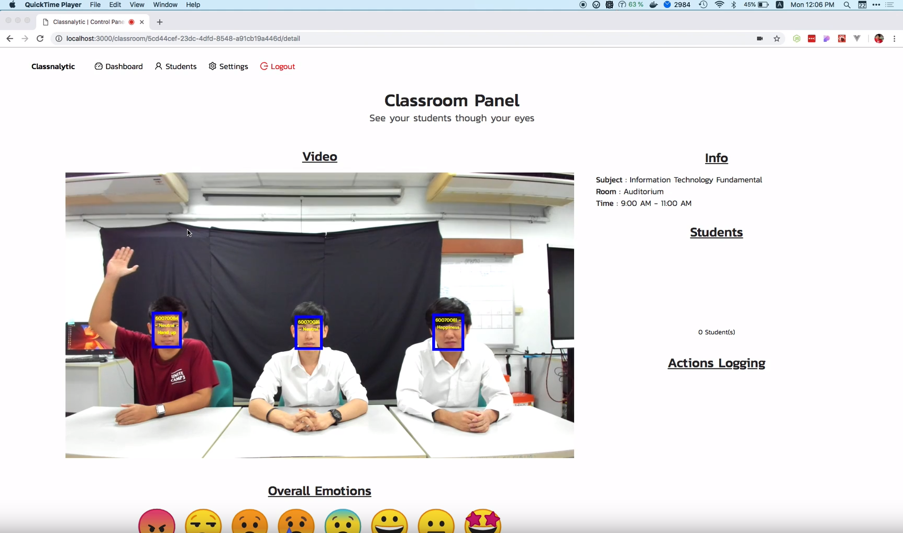
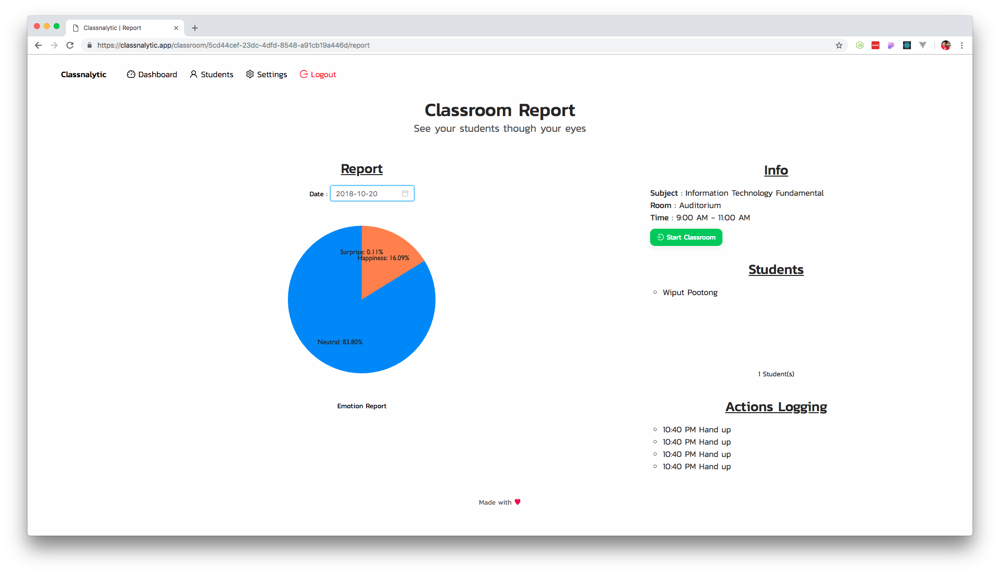

# classnalytic-ML
Repository of Classnalytic Machine Learning API contain Face Recognition, Emotion Recognition and Action classification systems. using [MTCNN](https://kpzhang93.github.io/MTCNN_face_detection_alignment/index.html) for face detection and alignment. CNN for recognize face and classifying emotion. For the action classifying we use [tf-pose-estimation](https://github.com/ildoonet/tf-pose-estimation) that implements [Openpose](https://github.com/CMU-Perceptual-Computing-Lab/openpose) to use Tensorflow. It uses get the joints of human body for classifying human actions. For web system visit [classnalytic-web](https://github.com/wiput1999/classnalytic-web) repository.

# About Classnalytic
## Introduction
Analysis of students's behaviour is important for instructors because it is one of feedbacks from students that let the instructors to understand their students. This can enable the instructors to be able to improve their teaching methods or materials. Examples of Tracking students' behaviour in the class are emotion, attendance, and action. Currently, it is very difficult and  laborious to observe these behaviours when there are a large number of students in a class. Therefore, we propose a system called "Classnalytic" to assist instructors to track students' behaviour in their class. The proposed system utilises computer vision and machine learning techniques to tackle the problem.

## Feature
The proposed system can identify students and perform attendance tracking using a camera installed at the front of the classroom

**Setup the camera**

Moreover, it can track students' emotion and action in real-time as well as generating a report after the class.

**Tracking students in the classroom**

**Report after the class**

## System Requirements and Tools
- Video camera installed, e.g. Webcam.
- Python 3.6 or later installed.
- Computer that run Debian or Ubuntu OS. (We tested on Ubuntu 16.04 LTS)
- NVIDIA GPU with CUDA core and at least 4GB of VRAM.
- RAM 8GB DDR3 or greater.
